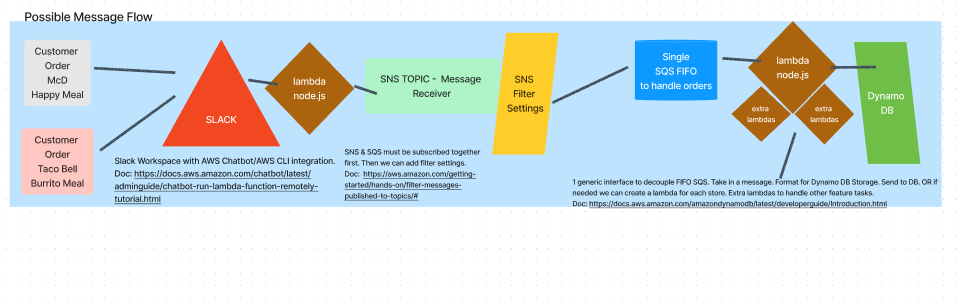
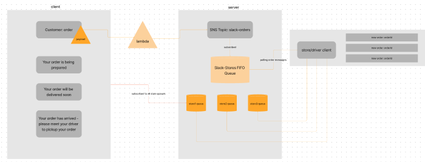
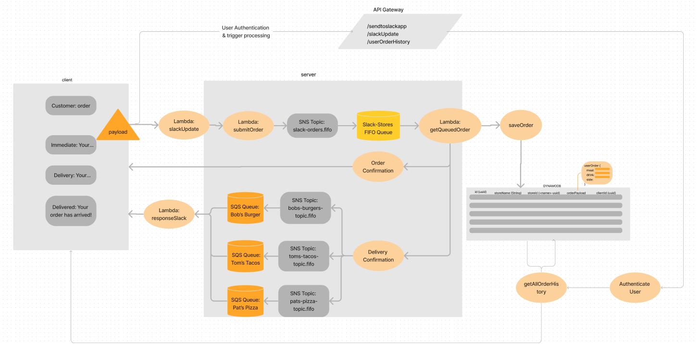

# Slack-N-Snack

## Join our Slack Channel and make an order [HERE](https://join.slack.com/t/slack-n-snackgroup/shared_invite/zt-1hvpujbae-81VBCK1AeZd9M4rwP_~7Qg)!

## Team Members

- Brandon Ge
- Elaine Huynh
- Mary Kariuki
- Kristopher Dunning
- Hayden Cleaver

## Description

Everyday users of convience apps such as UberEats or DoorDash share a common issue. Why must a user have to use a third-party to order food from restaurant? Studies show that food delivery consumers prefer to order directly from the restaurant. With Slack ‘n Snack, users can now communicate in real-time with a SlackBot to make orders to a restaurant of their choosing. Slack n' Snack is removing this middleman from food delivery apps and streamlining ordering and delivery processes. 

## Schema & Data Modeling Process

  ### Database Schema
  

  ### First Draft UML
  

  ### Initial Server Design
  

  ### Final Server Design
  

## Visit Our [Presentation Here](https://www.canva.com/design/DAFPmIV-E2k/H4f2nYpVIzUoD_GFYOgBJw/view?utm_content=DAFPmIV-E2k&utm_campaign=designshare&utm_medium=link2&utm_source=sharebutton) for a Slack n' Snack tutorial

### Documentation

[Initial UML/Problem Domain](https://www.figma.com/file/ucpDquxJi4ilE8ahwXyJB7/Mid-term-project?node-id=0%3A1)

[Trello](https://trello.com/b/ensxttxp/slack-n-snack)

[Requirements Documentation](./requirements.md)
